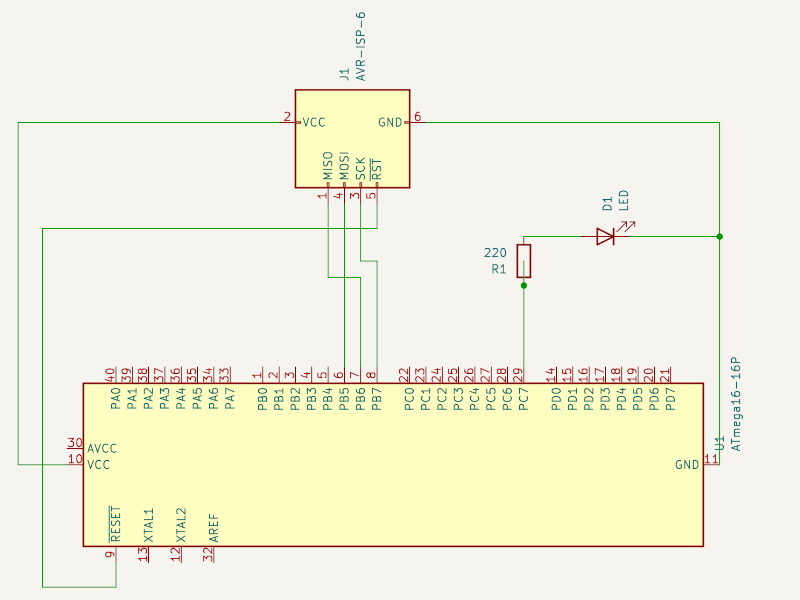
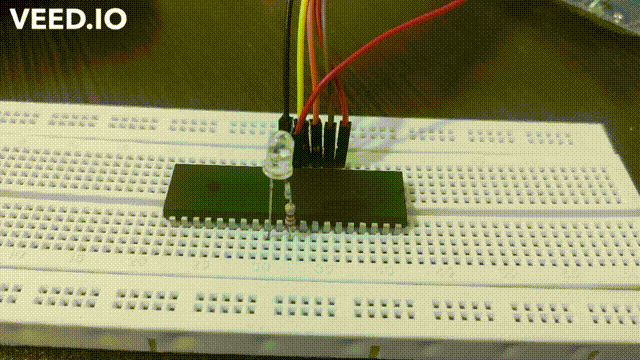

# Blink a LED
Simple Hello World! application on AVR ATmega16.

## Hardware Requirements:
1. ATmega16A
2. 220**𝛀** Resistor
3. LED
4. Breadboard
5. avrdude compatible AVR programmer (I used usbasp)

## Software Requirements:
1. VSCode + Extensions(C/C++, CMake, Commands)
2. CMake
3. avr-gcc
4. avrdude

## Schematic:


**Notes:**
- Using Port C7 for emiting LED is arbitrary

## Running steps:
Note that I used **Ubuntu** as my OS, so all commands here are Ubuntu commands.
1. **Installation**:
   1. install VSCode and extensions listed above. If you are a rookie in vscode see [Install Visual Studio Code extensions](https://code.visualstudio.com/learn/get-started/extensions)
   2. install avr-gcc, avrdude and some auxiliary apps:
    ```sh
    sudo apt-get install binutils gcc-avr avr-libc uisp avrdude
    ```

2. **Project Creation**:
   1. Create a directory for your project
   2. open VSCode and click **Open Folder..." on Get started page.
   3. Select created directory.
   4. Hit **Ctrl+N** to create a new file.
   5. type your **C** Code. (Use my code in **main.c** as a start)
3. **Config C/C++ Extension**:
   1. In the Command Palette (Open using **Ctrl+Shift+P**) type **Edit Configuration**. You should see an item titled **C/C++: Edit Configurations(UI)**. Click on it.
   2. You should provide some information:
      * Compiler path: You can find via ```which avr-gcc```. It is normally pointed to **/usr/bin/avr-gcc**
      * IntelliSense mode: Select **gcc-x86(legacy)**
      * Defines: for current project I used Atmega16. So I entered **__AVR_ATmega16A__**. Mind the underscores! You can find your chip on [https://www.nongnu.org/avr-libc/user-manual/using_tools.html](https://www.nongnu.org/avr-libc/user-manual/using_tools.html)
      * C standard: Select **c99**
      * C++ standard: Select **c++11**
4.  **Config Task Extension**:
    1.  Open Command Palette and type **Tasks: Configure Task** select proper result and then select **Create tasks.json file from template** and then select **Others**
    2.  Change the code to something like this:
```json
{
    // See https://go.microsoft.com/fwlink/?LinkId=733558
    // for the documentation about the tasks.json format
    "version": "2.0.0",
    "tasks": [
        {
            "label": "MakeAndFlash",
            "type": "shell",
            "command": "cd build && make flash",
            "problemMatcher": [],
            "group": {
                "kind": "build",
                "isDefault": true
            }
        }
    ]
}

```
5.  **Config Commands Extension**:
    1.  Open Command Palette and type **Commands: Edit Configuration**
    2.  Change opened file to something like this:
```json
{
  "commands": [
    {
      "command": "workbench.action.tasks.build",
      "text": "Build & Flash",
      "tooltip": "Build the project & flash To uc",
      "color": "#FFCC00"
    }
  ]
}
```
    3. Open Command Palette and Search **Commands: Refresh** and click on it. now you have see a button on status bar labled **Build & Flash** or whatever you selected. 
6.  **Create Workspace Settings file**:
    1.  From menu select **File -> Preferences -> Settings**
    2.  There is two tab on the page: User, and Workspace. Select **Workspace** and on the search bar enter **CMake** and select **CMake Tools** under **Extensions**
    3.  Scroll Down and find **CMake: Configure Settings** then click **Edit in settings.json**
    4.  Here you can set some global configuration variables for using in CMake.
    5.  Change it to something like:
```json
{
    "cmake.configureSettings": {
        "MCU": "atmega16a",
        "F_CPU": "8000000",
        "BAUD": "9600",
        "AVR_PART": "m16"
    }
}
```
7.  **Create CMake file**:
    1.  Create a file on root directory of your project name it: **CMakeLists.txt**
    2.  You can download it from my codes for starting point from [here](CMakeLists.txt)
8.  **RUN!**:
    1.  Connect your programmer to your system.
    2.  Hit **Ctrl+Shift+B** or click **Build & Flash** in the status bar.
    3.  Congratulations! you have made your fist embedded application!

**Preview:**


